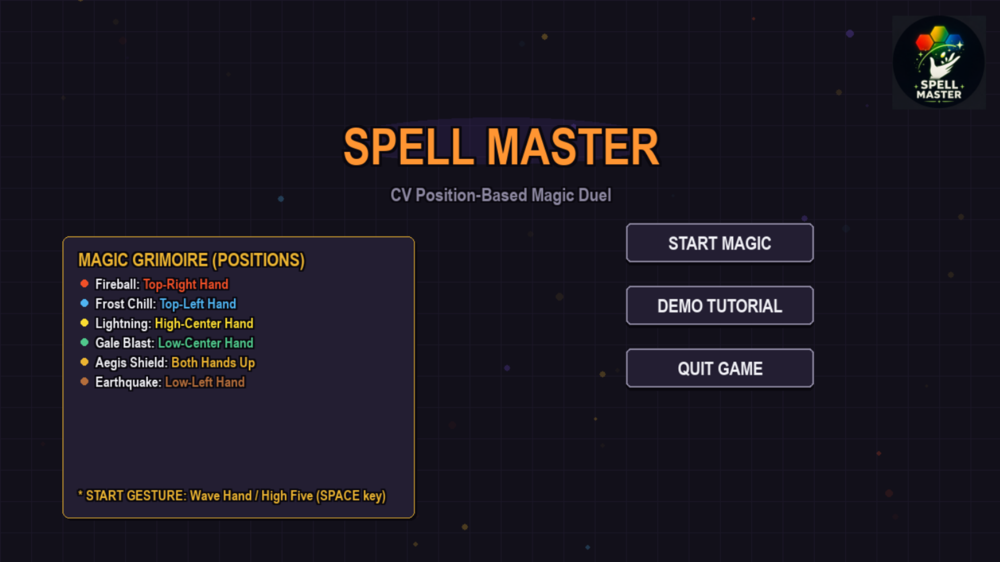
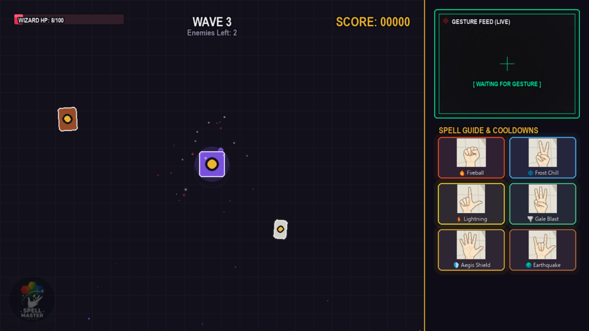
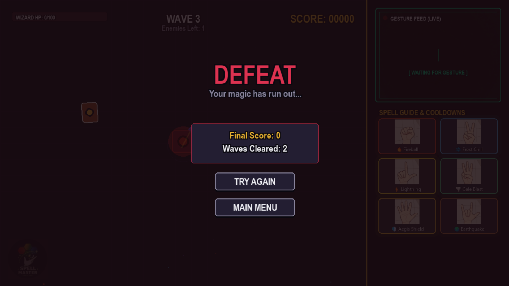

# Spell Master 🧙‍♂️✨

A small project under Microsoft Innovations Club (MIC) , VIT Chennai.
as part of the CLUB EXPO 2026.

Spell Master is a clean, modular 2D side-view fantasy game built in **Pygame**. It features a robust, decoupled architecture fully integrated with a **Computer Vision (CV) gesture-recognition system**. 

The latest version now utilizes an advanced **72-Dimensional Vector Embedding** system powered by Cosine Similarity, replacing older distance checks to provide hyper-accurate, tilt-resistant hand gesture detection.

---

## 📹 Video Demo

Watch the game in action!

*(Click below to view the demo)*
<br>
<video src="demo/SpellMasterFinalDemo-ishanmanisingh.mp4" width="800" controls></video>

Alternatively, you can view the video file directly here: [Video Demo](demo/SpellMasterFinalDemo-ishanmanisingh.mp4)

---

## 📸 Screenshots

### Start Screen


### Gameplay UI & Neon HUD


### End Screen


---

## ✨ Features & Upgrades

- **72D Vector Gesture Recognition:** Uses fingertip-to-wrist and inter-fingertip mathematical vectors with Cosine Similarity, guaranteeing zero false-positives even if extra fingers pop out accidentally.
- **Neon-Glow UI HUD:** An aesthetic 2x3 spell grid on the right sidebar with real-time cooldown tracking, smooth neon bloom borders, and custom gesture icons.
- **Audio Integration:** Full `.mp3` SFX for every spell cast and environmental effect.
- **Multi-threaded Architecture:** OpenCV/MediaPipe CV pipeline runs completely asynchronously in a background thread, pushing commands to the main Pygame rendering thread via a thread-safe Queue to maintain 60FPS.

---

## 🖐️ Gesture-to-Spell Mappings

Show the following gestures to the webcam to cast spells:

| Gesture | Spell | Description |
| :--- | :--- | :--- |
| 👊 **Fist** | 🔥 **Fireball** | Ignites & burns the closest enemy (Fast Cooldown). |
| ✌️ **Peace** | ❄️ **Frost Chill** | Freezes the closest enemy in place. |
| ☝️ **Lvibe** | ⚡ **Lightning** | Chain lightning combo strike across multiple enemies. |
| 🖖 **Threefinger** | 🌪️ **Gale Blast** | Pushes all active enemies far back. |
| ✋ **Palm** | 🛡️ **Aegis Shield** | Grants a damage-absorbing magical barrier. |
| 🤘 **Spiderman** | 🌍 **Earthquake** | Ultimate AoE attack that damages & slows the entire screen. |

---

## 📁 Project Structure

```text
SpellMaster/
│
├── main.py                  # Game entry point
├── game.py                  # Core Game class & Pygame Loop + CV Threading
├── settings.py              # Directory paths & general window settings
│
├── save.py                  # Utility script to save new custom hand gestures
├── tester.py                # 5-second timed gesture tester game with accuracy leaderboard
├── tester2.py               # Continuous real-time gesture auto-tester via webcam
├── async_example.py         # Demo for running the 72D gesture detector asynchronously in a background thread
├── client.py                # Websocket-client template for receiving gesture events remotely
├── gesture_utils.py         # 72D Vector embedding & Cosine Similarity math engine
├── gestures.json            # Database storing gesture vector embeddings
│
├── entities/                # Player (Wizard, Wizard Casting), Enemies (Goblins, Skeletons, Orcs), and Projectile classes
├── spells/                  # Spell definitions (Fireball, Frost, Lightning, Gale, Aegis, Earthquake), Cooldown manager
├── ui/                      # HUD renderer (2x3 Neon Grid, UI layouts), Menus, Animations (Neon Bloom effect)
├── managers/                # Enemy Wave spawner, Collision checks, Asset loader
└── utils/                   # Color schemes, stat values, spell properties, constants, helpers
```

---

## 🚀 Installation & How to Run

### 1. Prerequisites
Ensure you have **Python 3.9+** and a working webcam.

### 2. Set Up a Virtual Environment (Recommended)
Creating a virtual environment avoids library conflicts:
```bash
# Clone the repository (if not already done)
git clone https://github.com/micvitc/Club-Expo-Spell-Masters.git
cd Club-Expo-Spell-Masters

# Create virtual environment
python3 -m venv venv

# Activate virtual environment
source venv/bin/activate
```

### 3. Install Python Dependencies
Install the required packages using the project's [requirements.txt](file:///home/anasa/Projects/MIC-Spell-Masters/requirements.txt):
```bash
pip install -r requirements.txt
```
*(Packages include: `pygame`, `opencv-python`, `mediapipe`, `numpy`, `fastapi`, `uvicorn`, and `websockets`)*

### 4. Linux System Dependencies (If needed)
If you are on Linux (Ubuntu/Debian) and encounter `libGL.so` or OpenCV/MediaPipe startup errors, install the required system libraries:
```bash
sudo apt-get update
sudo apt-get install -y libgl1-mesa-glx libglib2.0-0
```

### 5. Running the Game
After completing the installation steps, run the game using:
```bash
python3 main.py
```
Show your hand to the webcam to play! (Check [Gesture-to-Spell Mappings](#🖐️-gesture-to-spell-mappings) for details.)

---

## 🛠️ Utility & Testing Scripts

We have provided several helper scripts to test the CV engine and integrate it with other architectures:

- **Interactive Gesture Calibration (`save.py`):**
  Use this to record new custom hand gesture vectors. Run it and follow the on-screen prompts to capture hand embeddings directly into the `gestures.json` database.
  ```bash
  python3 save.py
  ```

- **Timed Gesture Tester Game (`tester.py`):**
  A game-like tool to test all gestures in the database. You have 5 seconds to perform each gesture, and a live similarity percentage is shown. At the end, a leaderboard is printed with your highest scores.
  ```bash
  python3 tester.py
  ```

- **Continuous Auto-Tester (`tester2.py`):**
  Continuously analyzes your video feed and displays the detected gesture and confidence score. Perfect for tuning threshold values.
  ```bash
  python3 tester2.py
  ```

- **Asynchronous Background Detector (`async_example.py`):**
  A developer demo showing how to spin up the gesture detection engine on a background thread and handle detections asynchronously via callbacks.
  ```bash
  python3 async_example.py
  ```

- **Remote Event Client (`client.py`):**
  A lightweight WebSocket client boilerplate to demonstrate how you could broadcast gesture events over a network and consume them from external clients.
  ```bash
  python3 client.py
  ```
