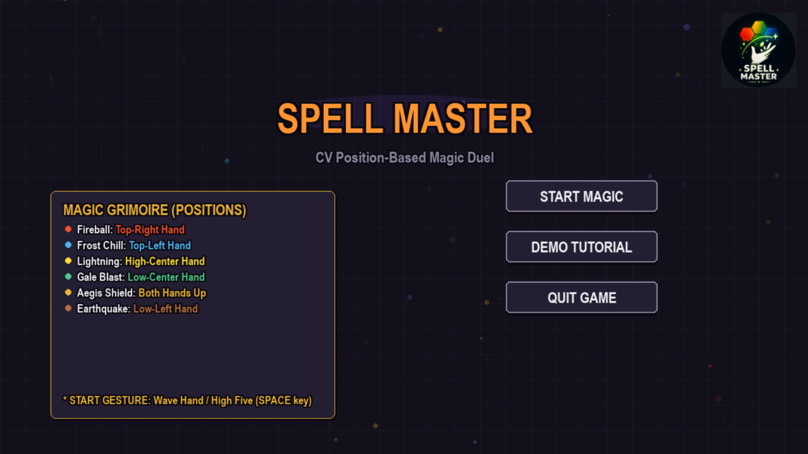
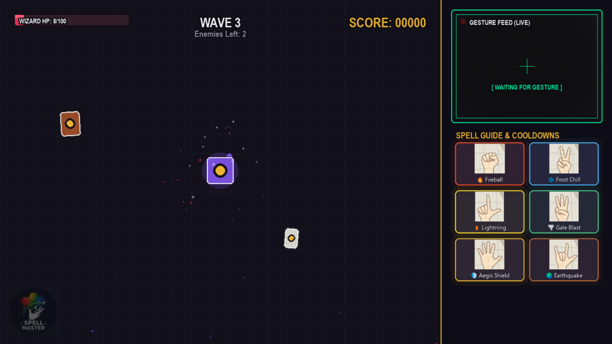
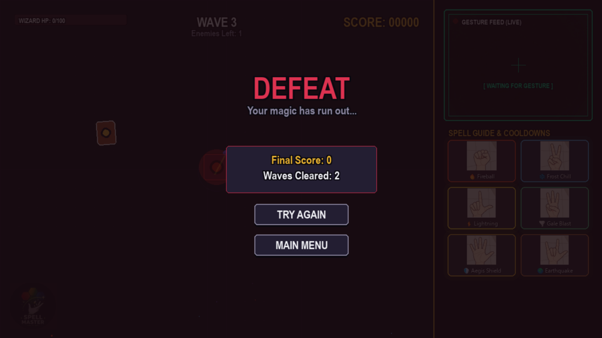

# Spell Master 🧙‍♂️✨

A small project under Microsoft Innovations Club (MIC) , VIT Chennai.
as part of the CLUB EXPO 2026.

Spell Master is a clean, modular 2D side-view fantasy game built in **Pygame**. It features a robust, decoupled architecture fully integrated with a **Computer Vision (CV) gesture-recognition system**. 

The latest version now utilizes an advanced **72-Dimensional Vector Embedding** system powered by Cosine Similarity, replacing older distance checks to provide hyper-accurate, tilt-resistant hand gesture detection.

---

## 📹 Video Demo

Watch the game in action!

*(Click below to view the demo)*
<br>
<video src="demo/SpellMasterFinalDemo-ishanmanisingh.mp4" width="800" controls></video>

Alternatively, you can view the video file directly here: [Video Demo](demo/SpellMasterFinalDemo-ishanmanisingh.mp4)

---

## 📸 Screenshots

### Start Screen


### Gameplay UI & Neon HUD


### End Screen


---

## ✨ Features & Upgrades

- **72D Vector Gesture Recognition:** Uses fingertip-to-wrist and inter-fingertip mathematical vectors with Cosine Similarity, guaranteeing zero false-positives even if extra fingers pop out accidentally.
- **Neon-Glow UI HUD:** An aesthetic 2x3 spell grid on the right sidebar with real-time cooldown tracking, smooth neon bloom borders, and custom gesture icons.
- **Audio Integration:** Full `.mp3` SFX for every spell cast and environmental effect.
- **Multi-threaded Architecture:** OpenCV/MediaPipe CV pipeline runs completely asynchronously in a background thread, pushing commands to the main Pygame rendering thread via a thread-safe Queue to maintain 60FPS.

---

## 🖐️ Gesture-to-Spell Mappings

Show the following gestures to the webcam to cast spells:

| Gesture | Spell | Description |
| :--- | :--- | :--- |
| 👊 **Fist** | 🔥 **Fireball** | Ignites & burns the closest enemy (Fast Cooldown). |
| ✌️ **Peace** | ❄️ **Frost Chill** | Freezes the closest enemy in place. |
| ☝️ **Lvibe** | ⚡ **Lightning** | Chain lightning combo strike across multiple enemies. |
| 🖖 **Threefinger** | 🌪️ **Gale Blast** | Pushes all active enemies far back. |
| ✋ **Palm** | 🛡️ **Aegis Shield** | Grants a damage-absorbing magical barrier. |
| 🤘 **Spiderman** | 🌍 **Earthquake** | Ultimate AoE attack that damages & slows the entire screen. |

---

## 📁 Project Structure

```text
SpellMaster/
│
├── main.py                  # Game entry point
├── game.py                  # Core Game class & Pygame Loop + CV Threading
├── settings.py              # Directory paths & general window settings
│
├── save.py                  # Utility script to save new custom hand gestures
├── tester2.py               # Utility script to test gestures directly via webcam
├── gesture_utils.py         # 72D Vector embedding & Cosine Similarity math engine
├── gestures.json            # Database storing gesture vector embeddings
│
├── entities/                # Player, Enemy (Goblins, Skeletons, Orcs), and Projectile classes
├── spells/                  # Spell definitions, Cooldown manager, and Visual effects
├── ui/                      # HUD renderer (2x3 Neon Grid, UI layouts), Menus, Animations
├── managers/                # Enemy Wave spawner, Collision checks, Asset loader
└── utils/                   # Color schemes, stat values, spell properties, helpers
```

---

## 🚀 How to Run the Game

1. Install Pygame and OpenCV/MediaPipe dependencies:
   ```bash
   pip install pygame opencv-python mediapipe numpy
   ```
2. Run the game from the root directory:
   ```bash
   python3 main.py
   ```
3. Show your hand to the webcam to play!

*(Note: If you want to add entirely new spells, you can use the `save.py` utility to register a new gesture directly into the `gestures.json` database!)*
